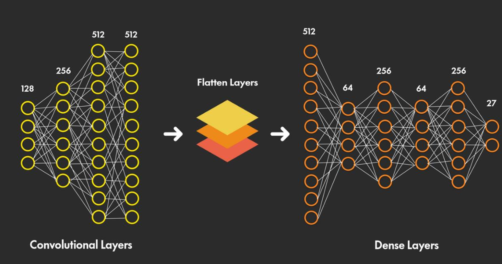

## Background  
Sign language serves as a crucial form of communication for individuals with hearing impairments. However, the communication divide between sign language users and non-users poses a significant challenge. This project aims to address this gap by developing a Sign Language Translation system using artificial intelligence. The system utilizes TensorFlow for training and fine-tuning a model capable of recognizing and translating sign language gestures into words and, subsequently, sentences. 

## Data Collection and Labeling:
### Manual Image Capture Using OpenCV 

The data collection process involved the manual capture of images for each sign using OpenCV. The resultant dataset comprised 27 classes, encompassing 26 letters and a space sign. Subsequently, a rigorous labeling procedure was implemented to facilitate upervised 
machine learning. 

Dataset Details: 
1. Number of Images:       5400
2. Number of Classes:      27
3. Images per Class:       200
4. Batch Size              128

## Data Preprocessing for Machine Learning 
To prepare the dataset for machine learning, several preprocessing steps were undertaken. The images were resized to dimensions of 48x48 pixels, converted to grayscale, and normalized by rescaling pixel values to a range between 0 and 1. The dataset was partitioned into training (80%) and validation (20%) sets, employing the split-folders library to ensure proper distribution.

## Model Architectrue 
The model architecture was formulated within the Keras framework. A Convolutional Neural Network (CNN) with four convolutional layers was established, featuring progressively diminishing filter sizes (128, 256, 512, 512) and strategically positioned dropout layers with a consistent dropout rate of 0.4. After the convolutional layers, fully connected layers were integrated with reducing neuron counts (512, 64, 256, 64, 256), complemented by dropout layers with variable rates. The output layer, consisting of 27 neurons corresponding to the dataset classes, employed the SoftMax activation function. 

## Model Development and Training 
The model consisted of convolutional layers, followed by fully connected layers. Dropout layers were strategically inserted to mitigate overfitting. The model underwent development and training utilizing the Adam optimizer and categorical Cross-entropy as the loss function. The training phase spanned 70 epochs with a batch size of 128. Training and validation datasets were employed to assess the model's performance, with a focus on quantifiable metrics such as accuracy and loss. 

Hyper-parameters: 
1. Layers:                    Convolutional 2D, Dense
2. Number of Layers:          4 Convolutional, 5 Dense
3. Dropout:                   40%
4. Batch Size:                128
5. Epochs                     70
6. Loss Function:             Categorical Cross Entropy

## Results 

Training Accuracy:           87.62% 
Testing Loss:                39.89% 
Validation Accuracy:         90.72% 
Validation Loss:             34.65% 

## References 

[1] Word-level Deep Sign Language Recognition by Dongxu Li et al.  
[Word-level Deep Sign language Recognition ](https://paperswithcode.com/paper/word-level-deep-sign-language-recognition)

[2] A Real-Time American Sign Language Recognition System using Convolutional 
Neural Network for Real Datasets by Rasha Amer Kadhim and Muntadher Khamees  
